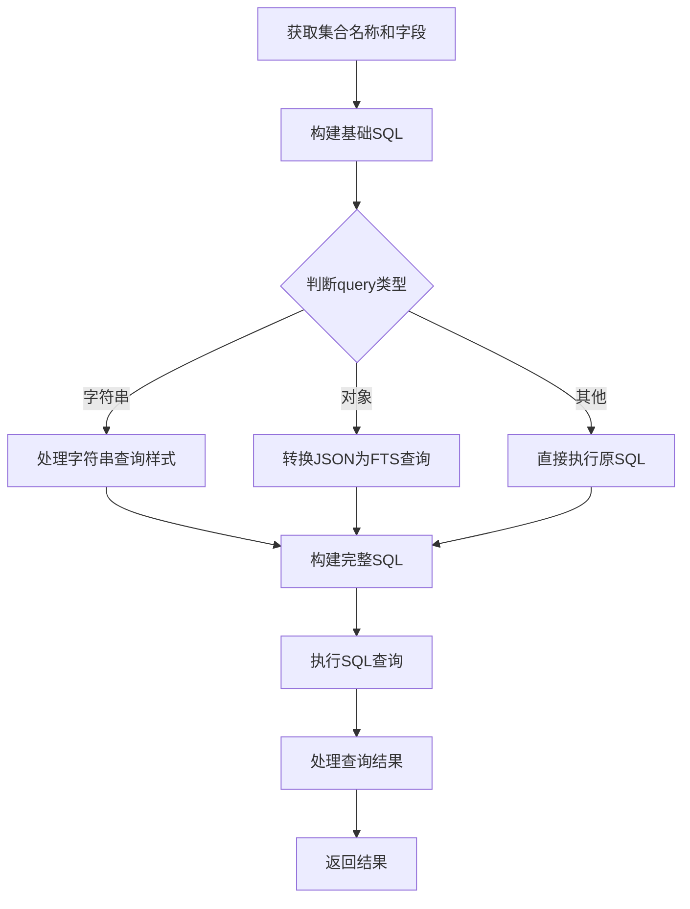

[**@isdk/ai-tool-sqlite**](../README.md)

***

[@isdk/ai-tool-sqlite](../globals.md) / KVSqliteCollection

# Class: KVSqliteCollection

Defined in: packages/kvsqlite/dist/index.d.ts:424

## Constructors

### new KVSqliteCollection()

> **new KVSqliteCollection**(`name`, `db`, `options`?): [`KVSqliteCollection`](KVSqliteCollection.md)

Defined in: packages/kvsqlite/dist/index.d.ts:451

Constructs a new instance of KVSqliteCollection.

This constructor initializes a new collection in the database with the specified name and options.
It handles the creation of the table if it does not already exist, sets up fields, and prepares SQL statements for various operations.

#### Parameters

##### name

`string`

The name of the collection.

##### db

[`KVSqlite`](KVSqlite.md)

The KVSqlite database instance.

##### options?

[`IKVCreateOptions`](../interfaces/IKVCreateOptions.md)

Optional settings for the collection, including fields, FTS configuration, and JSONB usage.

#### Returns

[`KVSqliteCollection`](KVSqliteCollection.md)

## Properties

### db

> `protected` **db**: [`KVSqlite`](KVSqlite.md)

Defined in: packages/kvsqlite/dist/index.d.ts:426

***

### jsonb

> **jsonb**: `string`

Defined in: packages/kvsqlite/dist/index.d.ts:439

***

### name

> **name**: `string`

Defined in: packages/kvsqlite/dist/index.d.ts:425

***

### preAdd

> **preAdd**: `Statement`

Defined in: packages/kvsqlite/dist/index.d.ts:427

***

### preAll

> **preAll**: `Statement`

Defined in: packages/kvsqlite/dist/index.d.ts:437

***

### preAllLimit

> **preAllLimit**: `Statement`

Defined in: packages/kvsqlite/dist/index.d.ts:438

***

### preCount

> **preCount**: `Statement`

Defined in: packages/kvsqlite/dist/index.d.ts:433

***

### preCountW

> **preCountW**: `Statement`

Defined in: packages/kvsqlite/dist/index.d.ts:434

***

### preDel

> **preDel**: `Statement`

Defined in: packages/kvsqlite/dist/index.d.ts:431

***

### preDelAll

> **preDelAll**: `Statement`

Defined in: packages/kvsqlite/dist/index.d.ts:432

***

### preExists

> **preExists**: `Statement`

Defined in: packages/kvsqlite/dist/index.d.ts:429

***

### preGet

> **preGet**: `Statement`

Defined in: packages/kvsqlite/dist/index.d.ts:430

***

### preSearchKey

> **preSearchKey**: `Statement`

Defined in: packages/kvsqlite/dist/index.d.ts:435

***

### preSearchKeyAll

> **preSearchKeyAll**: `Statement`

Defined in: packages/kvsqlite/dist/index.d.ts:436

***

### preUpdate

> **preUpdate**: `Statement`

Defined in: packages/kvsqlite/dist/index.d.ts:428

## Methods

### \_set()

> **\_set**(`obj`, `options`?): [`KVSqliteRunResult`](../interfaces/KVSqliteRunResult.md)

Defined in: packages/kvsqlite/dist/index.d.ts:452

#### Parameters

##### obj

[`IKVObjItem`](../interfaces/IKVObjItem.md)

##### options?

[`IKVSetOptions`](../interfaces/IKVSetOptions.md)

#### Returns

[`KVSqliteRunResult`](../interfaces/KVSqliteRunResult.md)

***

### \_setExtend()

> **\_setExtend**(`docId`, `key`, `value`, `options`?): [`KVSqliteRunResult`](../interfaces/KVSqliteRunResult.md)

Defined in: packages/kvsqlite/dist/index.d.ts:465

#### Parameters

##### docId

[`IKVDocumentId`](../type-aliases/IKVDocumentId.md)

##### key

`string`

##### value

`any`

##### options?

[`IKVSetOptions`](../interfaces/IKVSetOptions.md)

#### Returns

[`KVSqliteRunResult`](../interfaces/KVSqliteRunResult.md)

***

### buildWhereClause()

> **buildWhereClause**(`filter`, `options`?): `string`

Defined in: packages/kvsqlite/dist/index.d.ts:649

Builds a SQL WHERE clause from the provided filter conditions.

This function converts a record of filter conditions into a SQL WHERE clause string.

#### Parameters

##### filter

`Record`\<`string`, `any`\>

A record of key-value pairs representing the filter conditions.

##### options?

[`IKVSetOptions`](../interfaces/IKVSetOptions.md)

Optional settings including field information mappings.

#### Returns

`string`

A string representing the SQL WHERE clause.

***

### bulkDocs()

> **bulkDocs**(`objs`, `options`?): [`KVSqliteRunResult`](../interfaces/KVSqliteRunResult.md)[]

Defined in: packages/kvsqlite/dist/index.d.ts:501

Inserts or updates multiple documents in a transaction.

This function performs a bulk operation to insert or update multiple documents in the table.
It executes the operations within a transaction to ensure atomicity.

#### Parameters

##### objs

[`IKVObjItem`](../interfaces/IKVObjItem.md)[]

An array of objects representing the documents to insert or update.

##### options?

[`IKVSetOptions`](../interfaces/IKVSetOptions.md)

Optional settings for the operation.

#### Returns

[`KVSqliteRunResult`](../interfaces/KVSqliteRunResult.md)[]

An array of results from the insert or update operations.

***

### count()

> **count**(`query`?): `number`

Defined in: packages/kvsqlite/dist/index.d.ts:598

Counts the number of records in the collection based on the provided query.

This function returns the count of records that match the specified query.
If the query is an object, it constructs a SQL WHERE clause from the query object.

#### Parameters

##### query?

An optional string or object representing the query conditions.

`string` | `Record`\<`string`, `any`\>

#### Returns

`number`

The number of records matching the query.

***

### createIndex()

> **createIndex**(`index`, `options`?): [`KVSqliteRunResult`](../interfaces/KVSqliteRunResult.md)

Defined in: packages/kvsqlite/dist/index.d.ts:615

#### Parameters

##### index

[`IKVIndexOptions`](../interfaces/IKVIndexOptions.md)

##### options?

[`IKVCreateOptions`](../interfaces/IKVCreateOptions.md)

#### Returns

[`KVSqliteRunResult`](../interfaces/KVSqliteRunResult.md)

***

### createIndexes()

> **createIndexes**(`options`): [`KVSqliteRunResult`](../interfaces/KVSqliteRunResult.md)[]

Defined in: packages/kvsqlite/dist/index.d.ts:616

#### Parameters

##### options

[`IKVCreateOptions`](../interfaces/IKVCreateOptions.md)

#### Returns

[`KVSqliteRunResult`](../interfaces/KVSqliteRunResult.md)[]

***

### createJsonIndex()

> **createJsonIndex**(`indexName`, `fields`): [`KVSqliteRunResult`](../interfaces/KVSqliteRunResult.md)

Defined in: packages/kvsqlite/dist/index.d.ts:613

#### Parameters

##### indexName

`string`

##### fields

`string` | `string`[]

#### Returns

[`KVSqliteRunResult`](../interfaces/KVSqliteRunResult.md)

***

### createSchema()

> **createSchema**(`options`): `void`

Defined in: packages/kvsqlite/dist/index.d.ts:611

#### Parameters

##### options

[`IKVCreateOptions`](../interfaces/IKVCreateOptions.md)

#### Returns

`void`

***

### createTable()

> **createTable**(`name`, `options`): `void`

Defined in: packages/kvsqlite/dist/index.d.ts:612

#### Parameters

##### name

`string`

##### options

[`IKVCreateOptions`](../interfaces/IKVCreateOptions.md)

#### Returns

`void`

***

### createTableIndex()

> **createTableIndex**(`indexName`, `fields`): [`KVSqliteRunResult`](../interfaces/KVSqliteRunResult.md)

Defined in: packages/kvsqlite/dist/index.d.ts:614

#### Parameters

##### indexName

`string`

##### fields

`string` | `string`[]

#### Returns

[`KVSqliteRunResult`](../interfaces/KVSqliteRunResult.md)

***

### createTrigger()

> **createTrigger**(`trigger`, `options`?): `RunResult`

Defined in: packages/kvsqlite/dist/index.d.ts:617

#### Parameters

##### trigger

[`IKVTriggerOptions`](../interfaces/IKVTriggerOptions.md)

##### options?

[`IKVCreateOptions`](../interfaces/IKVCreateOptions.md)

#### Returns

`RunResult`

***

### del()

> **del**(`_id`?): [`KVSqliteRunResult`](../interfaces/KVSqliteRunResult.md) \| [`KVSqliteRunResult`](../interfaces/KVSqliteRunResult.md)[]

Defined in: packages/kvsqlite/dist/index.d.ts:579

Deletes records from the collection based on the provided ID, array of IDs, or filter conditions.

This function deletes records from the collection using the provided ID, array of IDs, or filter conditions.
It supports deleting multiple records within a transaction if an array of IDs is provided.
If a filter object is provided, it constructs a SQL WHERE clause from the filter and deletes matching records.
If no ID or filter is provided, it deletes all records in the collection.

#### Parameters

##### \_id?

An optional ID, array of IDs, or filter object representing the records to delete.

[`IKVDocumentId`](../type-aliases/IKVDocumentId.md) | [`IKVDocumentId`](../type-aliases/IKVDocumentId.md)[] | `Record`\<`string`, `any`\>

#### Returns

[`KVSqliteRunResult`](../interfaces/KVSqliteRunResult.md) \| [`KVSqliteRunResult`](../interfaces/KVSqliteRunResult.md)[]

The result of the delete operation(s).

***

### delExtend()

> **delExtend**(`docId`, `aPropName`?): [`KVSqliteRunResult`](../interfaces/KVSqliteRunResult.md) \| [`KVSqliteRunResult`](../interfaces/KVSqliteRunResult.md)[]

Defined in: packages/kvsqlite/dist/index.d.ts:554

Deletes an extended property for a document based on the specified property name.

This function deletes a specific property for a document using the provided document ID and property name.
If no property name is provided, it deletes the entire document.

#### Parameters

##### docId

[`IKVDocumentId`](../type-aliases/IKVDocumentId.md)

The ID of the document.

##### aPropName?

`string`

An optional string representing the property name to delete.

#### Returns

[`KVSqliteRunResult`](../interfaces/KVSqliteRunResult.md) \| [`KVSqliteRunResult`](../interfaces/KVSqliteRunResult.md)[]

The result of the delete operation.

***

### drop()

> **drop**(): `void`

Defined in: packages/kvsqlite/dist/index.d.ts:713

Drops the current table from the database.

This function removes the table associated with the current instance from the database.

#### Returns

`void`

***

### enableFts()

> **enableFts**(`options`?): `void`

Defined in: packages/kvsqlite/dist/index.d.ts:660

#### Parameters

##### options?

[`IKVCreateFtsOptions`](../interfaces/IKVCreateFtsOptions.md)

#### Returns

`void`

***

### get()

> **get**(`_id`): [`IKVObjItem`](../interfaces/IKVObjItem.md)

Defined in: packages/kvsqlite/dist/index.d.ts:511

Retrieves a document by its ID and ensures it includes the document ID.

This function fetches a document from the table using the provided document ID.
It ensures that the returned object includes the document ID as a property.

#### Parameters

##### \_id

[`IKVDocumentId`](../type-aliases/IKVDocumentId.md)

The ID of the document to retrieve.

#### Returns

[`IKVObjItem`](../interfaces/IKVObjItem.md)

The retrieved document as an object with the document ID included.

***

### getEx()

> **getEx**(`_id`): `string` \| `number` \| `boolean` \| [`IKVObjItem`](../interfaces/IKVObjItem.md)

Defined in: packages/kvsqlite/dist/index.d.ts:521

Retrieves a document by its ID and processes the result.

This function fetches a document from the table using the provided document ID.
It processes the result by parsing SQL fields, handling JSON values, and mapping fields as necessary.

#### Parameters

##### \_id

[`IKVDocumentId`](../type-aliases/IKVDocumentId.md)

The ID of the document to retrieve.

#### Returns

`string` \| `number` \| `boolean` \| [`IKVObjItem`](../interfaces/IKVObjItem.md)

The retrieved document as an object, string, boolean, or number.

***

### getExtend()

> **getExtend**(`docId`, `aPropName`?): `any`

Defined in: packages/kvsqlite/dist/index.d.ts:532

Retrieves the value of an extended property for a document based on the specified property name.

This function fetches the value of a specific property for a document using the provided document ID and property name.
If no property name is provided, it retrieves the entire document.

#### Parameters

##### docId

[`IKVDocumentId`](../type-aliases/IKVDocumentId.md)

The ID of the document.

##### aPropName?

`string`

An optional string representing the property name to retrieve.

#### Returns

`any`

The value of the specified property or the entire document if no property name is provided.

***

### getExtends()

> **getExtends**(`docId`, `aPropName`?, `options`?): [`IKVObjItem`](../interfaces/IKVObjItem.md)

Defined in: packages/kvsqlite/dist/index.d.ts:567

Retrieves extended properties for a document based on the specified property names or patterns.

This function fetches properties for a document using the provided document ID and property names or patterns.
It supports retrieving single or multiple properties and can return either a single value or an object containing all properties.

#### Parameters

##### docId

[`IKVDocumentId`](../type-aliases/IKVDocumentId.md)

The ID of the document.

##### aPropName?

An optional string or array of strings representing the property names or patterns.

`string` | `string`[]

##### options?

[`IKVSetOptions`](../interfaces/IKVSetOptions.md)

Optional settings including whether to return a single value.

#### Returns

[`IKVObjItem`](../interfaces/IKVObjItem.md)

The retrieved extends properties as an object or a single value if `singleValue` is true.

***

### getSchema()

> **getSchema**(): `any`

Defined in: packages/kvsqlite/dist/index.d.ts:610

#### Returns

`any`

***

### isExists()

> **isExists**(`_id`): `boolean`

Defined in: packages/kvsqlite/dist/index.d.ts:588

Checks if a record with the specified ID exists in the table.

This function returns a boolean indicating whether a record with the given ID exists.

#### Parameters

##### \_id

[`IKVDocumentId`](../type-aliases/IKVDocumentId.md)

The ID of the record to check.

#### Returns

`boolean`

A boolean indicating whether the record exists.

***

### isExistsExtend()

> **isExistsExtend**(`docId`, `aPropName`?): `boolean`

Defined in: packages/kvsqlite/dist/index.d.ts:543

Checks if an extended property exists for a document based on the specified property name.

This function checks if a specific property exists for a document using the provided document ID and property name.
If no property name is provided, it checks for the existence of the entire document.

#### Parameters

##### docId

[`IKVDocumentId`](../type-aliases/IKVDocumentId.md)

The ID of the document.

##### aPropName?

`string`

An optional string representing the property name to check.

#### Returns

`boolean`

A boolean indicating whether the property exists.

***

### list()

> **list**(`query`?, `options`?): [`IKVObjItem`](../interfaces/IKVObjItem.md)[]

Defined in: packages/kvsqlite/dist/index.d.ts:609

Lists records from the table based on the provided query and options.

This function retrieves records from the table, applying optional filters, sorting, pagination,
and field selection. It supports both string queries and object-based query options.

#### Parameters

##### query?

A string or object representing the query conditions.

`string` | [`IKVSetOptions`](../interfaces/IKVSetOptions.md)

##### options?

[`IKVSetOptions`](../interfaces/IKVSetOptions.md)

Optional settings including size, page, sort order, and field names.

#### Returns

[`IKVObjItem`](../interfaces/IKVObjItem.md)[]

An array of objects representing the listed records.

***

### search()

> **search**(`filter`, `options`?): [`IKVObjItem`](../interfaces/IKVObjItem.md)[]

Defined in: packages/kvsqlite/dist/index.d.ts:639

Searches for records based on the provided filter conditions.

This function constructs a SQL WHERE clause using the provided filter and options,
and then performs the search using the constructed WHERE clause.

#### Parameters

##### filter

`Record`\<`string`, `any`\>

A record of key-value pairs representing the filter conditions.

##### options?

[`IKVSetOptions`](../interfaces/IKVSetOptions.md)

Optional settings including field information mappings.

#### Returns

[`IKVObjItem`](../interfaces/IKVObjItem.md)[]

The result of the search operation.

***

### searchEx()

> **searchEx**(`query`, `options`?): [`IKVObjItem`](../interfaces/IKVObjItem.md)[]

Defined in: packages/kvsqlite/dist/index.d.ts:628

Executes an advanced search query on the database.

This function constructs and executes a SQL query based on the provided query string or object,
options for sorting, pagination, and field selection.

#### Parameters

##### query

A string or record of key-value pairs representing the search query.

`string` | `Record`\<`string`, `string`\>

##### options?

[`IKVSetOptions`](../interfaces/IKVSetOptions.md)

Optional settings including field information mappings, sorting, pagination, and field names.

#### Returns

[`IKVObjItem`](../interfaces/IKVObjItem.md)[]

An array of objects representing the search results.

***

### searchFts()

> **searchFts**(`query`, `options`?): `object`[]

Defined in: packages/kvsqlite/dist/index.d.ts:704

Searches the full-text search (FTS) index for records matching the provided query.

This function constructs and executes a SQL query to search the FTS index of the specified collection.
It supports different query styles and options for field selection and deserialization.

#### Parameters

##### query

A string, object, or array of objects representing the search query.

`string` | `Record`\<`string`, `any`\> | `Record`\<`string`, `any`\>[]

##### options?

[`IKVSetOptions`](../interfaces/IKVSetOptions.md) & [`IKVCreateFtsOptions`](../interfaces/IKVCreateFtsOptions.md)

Optional settings including collection name, field names, FTS query style, and deserialization options.

#### Returns

`object`[]

An array of objects representing the search results.



ftsQueryStyle is a boolean or string(the function name), which determines the query style.

ftsQueryStyle = false or unset:
- If false or undefined, simple mode, wrapped with single quote, it generates a simple fts MATCH string query.
- If true, andvanced mode, directly concatenate the query content, no any wrap， must be a valid SQLite fts query syntax.
- If a string, it wraps the query content with the specified SQLite function, eg `simple_query`

#### Example

```ts
searchFts("hello", { ftsQueryStyle: false });
`Gnerate SQL Condition: MATCH 'hello'`

searchFts({ $or: ["apple", "banana"] }, { ftsQueryStyle: false });
`Gnerate SQL Condition: MATCH 'apple OR banana'`

searchFts("senior | backend", { ftsQueryStyle: "replace(?, '|', 'OR')" });
`Gnerate SQL Condition: MATCH replace('senior | backend', '|', 'OR')`
```

***

### set()

> **set**(`docId`, `obj`?, `options`?): [`KVSqliteRunResult`](../interfaces/KVSqliteRunResult.md)

Defined in: packages/kvsqlite/dist/index.d.ts:464

Sets or updates a document in the table.

This function inserts or updates a document in the table using the provided document ID and object.
It supports different parameter configurations and executes the operation within a transaction to ensure atomicity.

#### Parameters

##### docId

The ID of the document or an object representing the document.

[`IKVObjItem`](../interfaces/IKVObjItem.md) | [`IKVDocumentId`](../type-aliases/IKVDocumentId.md)

##### obj?

An optional object representing the document or options.

[`IKVObjItem`](../interfaces/IKVObjItem.md) | [`IKVSetOptions`](../interfaces/IKVSetOptions.md)

##### options?

[`IKVSetOptions`](../interfaces/IKVSetOptions.md)

Optional settings for the operation.

#### Returns

[`KVSqliteRunResult`](../interfaces/KVSqliteRunResult.md)

The result of the set operation.

***

### setExtend()

> **setExtend**(`docId`, `key`, `value`, `options`?): [`KVSqliteRunResult`](../interfaces/KVSqliteRunResult.md)

Defined in: packages/kvsqlite/dist/index.d.ts:478

Sets an extended property for a document in a transaction.

This function updates or inserts a specific property for a document using the provided document ID, key, and value.
It executes the operation within a transaction to ensure atomicity.

#### Parameters

##### docId

[`IKVDocumentId`](../type-aliases/IKVDocumentId.md)

The ID of the document.

##### key

`string`

The key of the property to set.

##### value

`any`

The value of the property to set.

##### options?

[`IKVSetOptions`](../interfaces/IKVSetOptions.md)

Optional settings for the operation.

#### Returns

[`KVSqliteRunResult`](../interfaces/KVSqliteRunResult.md)

The result of the set operation.

***

### setExtends()

> **setExtends**(`docId`, `aDoc`, `options`?): [`KVSqliteRunResult`](../interfaces/KVSqliteRunResult.md)[]

Defined in: packages/kvsqlite/dist/index.d.ts:490

Sets multiple extended properties for a document in a transaction.

This function updates or inserts multiple properties for a document using the provided document ID and an object of properties.
It executes the operations within a transaction to ensure atomicity.

#### Parameters

##### docId

[`IKVDocumentId`](../type-aliases/IKVDocumentId.md)

The ID of the document.

##### aDoc

`any`

An object containing the properties to set.

##### options?

[`IKVSetOptions`](../interfaces/IKVSetOptions.md)

Optional settings for the operation.

#### Returns

[`KVSqliteRunResult`](../interfaces/KVSqliteRunResult.md)[]

An array of results from the set operations.

***

### tableInfo()

> **tableInfo**(`options`?): `undefined` \| `Required`\<[`IKVFieldOptions`](../interfaces/IKVFieldOptions.md)\>

Defined in: packages/kvsqlite/dist/index.d.ts:659

Retrieves information about the table structure.

This function queries the database to get detailed information about the specified table,
including field names, types, constraints, and default values.

#### Parameters

##### options?

[`IKVSetOptions`](../interfaces/IKVSetOptions.md)

Optional settings including the collection name and whether to map field names.

#### Returns

`undefined` \| `Required`\<[`IKVFieldOptions`](../interfaces/IKVFieldOptions.md)\>

An object containing detailed information about the table fields.
